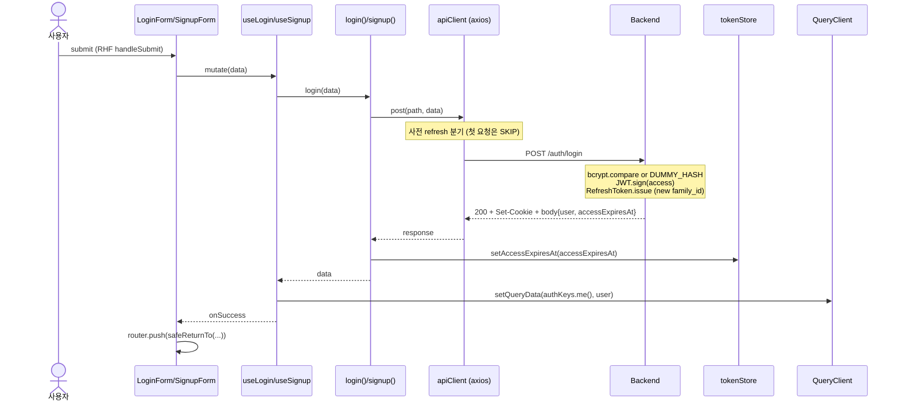
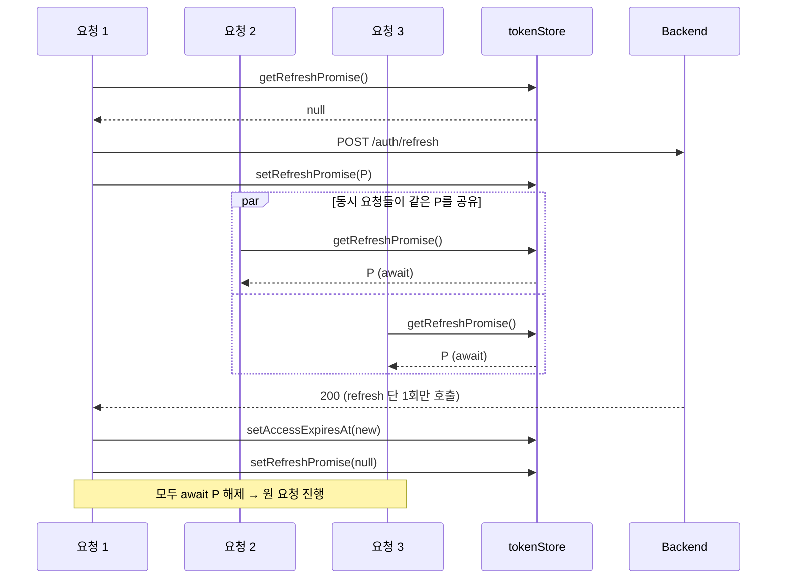
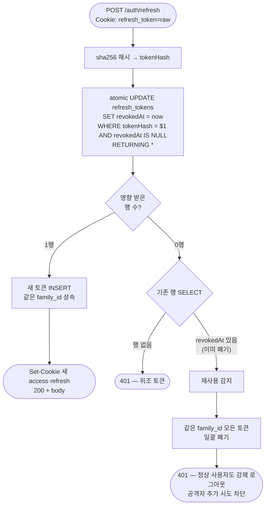
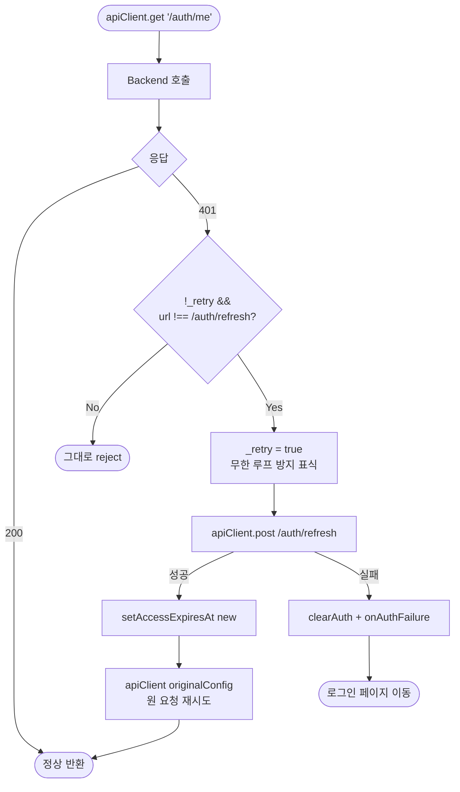
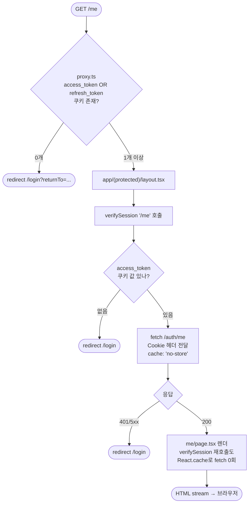
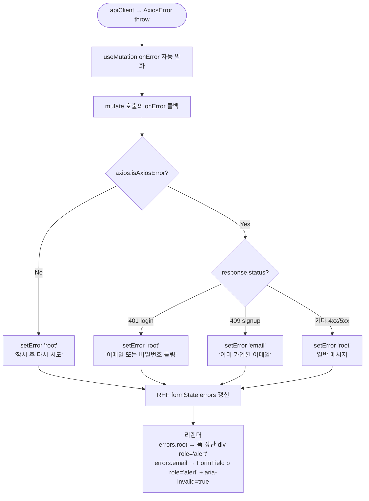
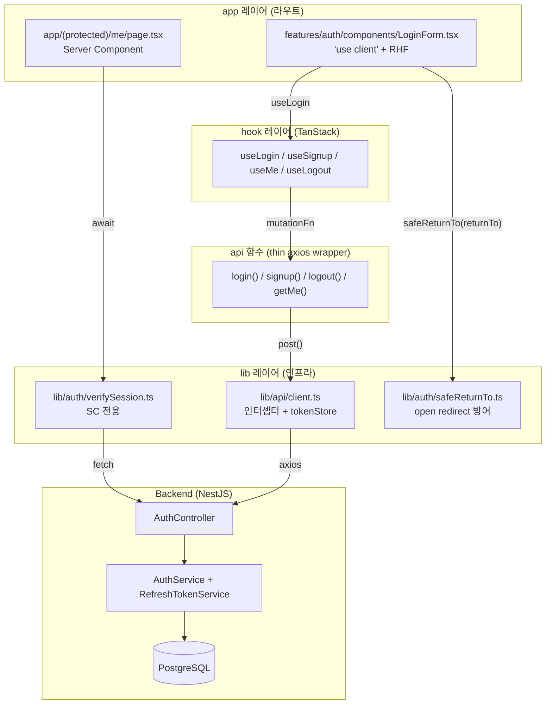

## 배경

1. 이번 세션에서는 limjaejoon.com 모노레포에 이메일/비밀번호 인증과 access/refresh JWT 세션을 풀스택으로 구현했다.
2. 8개 ADR로 설계를 굳히고 Phase 1-8까지 진행하며 백엔드(NestJS) → 프론트(Next.js 16) → 테스트 → 외부 리뷰 → 회고 순서로 마무리했다.
3. 이 문서는 그 과정에서 등장한 개념과 패턴을 도메인별로 정리해 추후 다른 기능을 만들 때 참고할 수 있게 한다.

## 데이터 흐름 시각화

1. 인증 시스템은 여러 흐름이 얽혀 있어 텍스트 설명만으로는 잡기 어려우므로, 이번 플랜에서 구현한 7가지 핵심 흐름을 Mermaid 도식으로 정리한다.
2. 첫 번째는 회원가입·로그인 흐름으로, 폼 제출이 mutation을 거쳐 백엔드 → DB → 응답을 받고 마지막으로 me 캐시를 채우는 한 사이클이다.



3. 두 번째는 사전 refresh 흐름으로, 만료 임박 시 동시에 들어온 여러 요청이 단 한 번의 refresh를 공유하는 뮤텍스 패턴이다.



4. 세 번째는 refresh 토큰 회전과 재사용 감지로, atomic UPDATE+RETURNING이 race-safe 핵심이다.



5. 네 번째는 401 reactive fallback 흐름으로, 사전 refresh가 놓친 케이스를 응답 인터셉터가 한 번 더 만회한다.



6. 다섯 번째는 보호 라우트 2층 게이트로, proxy.ts(빠른 1차)와 SC verifySession(정밀 2차)이 짝을 이룬다.



7. 여섯 번째는 에러 매핑 흐름으로, 백엔드가 던진 axios 에러를 react-hook-form의 errors 객체로 합류시키는 onError 브리지다.



8. 일곱 번째는 책임 레이어 전체 그림으로, 한 호출에 lib·providers·features·app·backend가 어떻게 협력하는지 보여준다.



9. 이 7개 흐름을 머릿속에 그려두면 이후 코드를 읽거나 디버깅할 때 어디를 봐야 하는지 빠르게 잡힌다.

## Docker와 인프라

1. docker compose build는 docker-compose.yml의 build 섹션을 따라 이미지를 한 번 만드는 단계이고, docker compose up은 그 이미지로 컨테이너를 띄우고 네트워크에 연결하는 단계다.
2. 즉 build는 재료 준비, up은 요리를 실제로 만드는 행위로 분리되어 있다.
3. 코드만 바뀌면 build 없이 up만으로 충분하지만, Dockerfile이나 의존성이 바뀌면 build를 다시 해야 새 이미지로 컨테이너가 시작된다.
4. .env는 시크릿이 들어있어 .gitignore에 두고 절대 커밋하지 않지만, .env.example은 키 목록과 placeholder만 담아 동료가 어떤 변수를 채워야 하는지 알려주는 청사진 역할이라 커밋한다.
5. docker-compose.yml은 여러 컨테이너의 관계를 선언적으로 정의하는 설정으로, services·volumes·networks·depends_on을 한 번에 명시해 docker compose up 한 번에 전체 스택이 뜨도록 만든다.
6. 우리 설정에는 backend 서비스의 depends_on에 condition: service_healthy가 있어, postgres가 단순히 프로세스로만 떠있는 상태가 아니라 pg_isready 헬스체크를 통과해 접속을 받아들일 준비가 된 후에야 backend가 시작된다.
7. 이게 없으면 backend가 먼저 떠서 postgres에 접속을 시도하다가 connection refused로 죽는 race condition이 자주 발생한다.
8. 코드를 수정했을 때 컨테이너에 즉시 반영되는 이유는 backend 서비스에 bind mount가 걸려있어 호스트의 backend 디렉토리가 컨테이너의 /workspace/backend와 실시간 동기화되기 때문이고, NestJS의 watch 모드가 변경을 감지해 자동 재시작한다.
9. 다만 node_modules는 익명 볼륨으로 격리해 호스트의 빈 node_modules가 컨테이너의 설치된 node_modules를 덮어쓰지 않도록 보호한다.
10. npm 워크스페이스 모노레포에서는 컨테이너 안 워크디렉터리가 모노레포 루트라 npm run migration:run을 그냥 실행하면 루트 package.json을 보고 실패하므로, -w backend 플래그로 백엔드 워크스페이스를 명시해야 한다.

```sh
docker compose exec backend npm run migration:run -w backend
```

## 데이터베이스 마이그레이션

1. DB 마이그레이션은 프로젝트를 옮기는 행위가 아니라 DB 스키마를 코드처럼 버전 관리하는 표준 방식이다.
2. 개발하는 동안 테이블·컬럼·인덱스가 계속 바뀌는데, 그걸 SQL 문 자체로 파일에 박아 Git에 커밋하면 모든 환경이 똑같은 순서로 적용해 동일한 스키마에 도달할 수 있다.
3. TypeORM은 migrations 메타 테이블에 어디까지 적용했는지를 기록하므로, 같은 명령을 두 번 실행해도 적용된 마이그레이션은 스킵된다.
4. 각 마이그레이션 파일은 영구 보관이 원칙이고, 새 변경은 새 파일을 추가하는 식으로만 진행한다.
5. 운영에서 sql만 수동으로 치면 환경 간 스키마 차이가 생기고 디버깅이 지옥이 되므로, 마이그레이션은 DB의 Git 히스토리라고 생각하면 된다.

## NestJS 핵심 개념

1. NestJS는 모듈·컨트롤러·서비스를 데코레이터로 분리하는 프레임워크로, app.module.ts가 루트에서 모든 것을 조립한다.
2. ConfigModule.forRoot에 validationSchema를 넘기면 부팅 시점에 환경 변수를 검증해 미달 시 기동 자체를 실패시키는데, 우리는 Joi를 썼다.
3. Joi 스키마에는 POSTGRES_*, JWT_*, BCRYPT_ROUNDS, COOKIE_*, FRONTEND_ORIGIN을 모두 등록하고, JWT_*_TTL은 정규식 /^\d+[smhd]$/로 단위 형식까지 강제했다.
4. 두 JWT 시크릿이 동일하면 access·refresh를 한 시크릿으로 모두 검증할 수 있어 보안 구멍이 되므로, .custom() 검증으로 같은 값을 거부했다.
5. ValidationPipe는 DTO 클래스의 class-validator 데코레이터를 보고 요청 body를 검증하며, whitelist + forbidNonWhitelisted + transform + (prod) disableErrorMessages 조합이 표준이다.
6. Swagger UI는 main.ts에서 prod가 아닐 때만 마운트하고, 컨트롤러의 @ApiTags·@ApiOperation·@ApiResponse·@ApiCookieAuth 데코레이터와 DTO의 @ApiProperty가 자동 합성되어 /api/docs에 노출된다.
7. NestJS 아키텍처 더 깊은 정리는 reports/2026-04-26-nestjs-architecture.md에 별도로 남겼다.

## bcrypt와 timing 공격 방어

1. login에서 사용자가 존재하지 않으면 bcrypt.compare를 안 도는데 비밀번호 비교는 약 300ms 걸리므로, 응답 시간 차이로 가입된 이메일을 enumeration 할 수 있다.
2. 이걸 막기 위해 모듈 로드 시 한 번만 더미 해시를 만들어 두고, 사용자가 없을 때도 더미 해시로 bcrypt.compare를 강제로 돌려 응답 시간을 균등화한다.

```ts
let _dummyHashPromise: Promise<string> | null = null;
function getDummyHashPromise(rounds: number): Promise<string> {
  if (!_dummyHashPromise) {
    _dummyHashPromise = bcrypt.hash('dummy-password-for-timing', rounds);
  }
  return _dummyHashPromise;
}
```

3. 더미 해시를 매번 새로 만들면 hash 자체에 시간이 또 들어 timing이 깨지므로 모듈 싱글턴으로 1회만 생성하는 것이 핵심이다.
4. 또한 사용자 미존재와 비밀번호 불일치를 동일한 401 메시지("Invalid credentials")로 응답해 응답 본문도 enumeration의 단서가 안 되도록 했다.

## Refresh 토큰 회전과 재사용 감지

1. refresh 토큰은 32바이트 랜덤을 base64url로 직렬화한 opaque 토큰이고, DB에는 sha-256 해시만 저장해 토큰 원본 유출을 막는다.
2. /auth/refresh 호출 시 atomic UPDATE+RETURNING으로 revokedAt이 NULL인 행을 한 번에 폐기하고 새 토큰을 발급해 race condition을 막는다.
3. 핵심 SQL은 UPDATE refresh_tokens SET revokedAt=now() WHERE tokenHash=$1 AND revokedAt IS NULL RETURNING * 형태로, 동시에 두 개의 같은 토큰 요청이 들어와도 한 쪽만 회전에 성공한다.
4. 만약 update가 0행을 반환하고 토큰 행 자체가 존재하면 그건 이미 폐기된 토큰을 누군가 다시 쓴 것이라 판단해 같은 family_id의 모든 토큰을 일괄 폐기해 강제 로그아웃 시킨다.
5. family_id는 최초 로그인 시 한 번 생성되고 회전 시 그대로 상속되어, 한 사용자의 한 세션이 시간에 따라 회전한 토큰 묶음을 의미한다.
6. 이 모델로 토큰 탈취 후 공격자와 정상 사용자가 동시에 회전을 시도하면 한쪽이 실패하고 그 시점에 family 전체를 폐기해 둘 다 강제 로그아웃되는 안전한 결과로 수렴한다.

## httpOnly 쿠키와 tokenStore

1. JWT를 localStorage에 두면 XSS 한 번에 토큰이 그대로 탈취되므로, access_token·refresh_token은 모두 httpOnly 쿠키로만 보낸다.
2. httpOnly 쿠키는 JS에서 절대 읽을 수 없고 브라우저가 같은 origin 요청에 자동 첨부하므로 XSS 시점의 토큰 탈취가 차단된다.
3. 단점은 JS가 토큰의 만료 시각을 알 수 없다는 것이라, 백엔드가 응답 body에 accessExpiresAt(epoch ms)만 따로 보내고 프론트는 이 값으로 사전 refresh 타이머를 굴린다.
4. 토큰 값 자체는 절대 저장하지 않고 만료 시각과 in-flight refresh 뮤텍스만 모듈 스코프 변수로 보관하는 게 tokenStore의 역할이다.

```ts
let accessExpiresAt: number | null = null;
let refreshPromise: Promise<void> | null = null;
```

## 사전(Proactive) Refresh와 뮤텍스

1. 만료 후 401을 받고 나서 refresh 하면 사용자가 한 번은 깜빡임을 겪지만, 만료 직전에 미리 갱신하면 401을 거의 안 본다.
2. axios의 request 인터셉터에서 Date.now() + 60s 가 accessExpiresAt 이상이면 사전 refresh를 시작한다.
3. 동시에 여러 컴포넌트가 fetch를 발사하면 여러 refresh가 동시에 일어나 race condition이 생기므로, 첫 요청만 새 Promise를 만들고 나머지는 그 Promise를 await하는 뮤텍스 패턴을 쓴다.

```ts
if (getRefreshPromise() === null) {
  setRefreshPromise(apiClient.post('/auth/refresh').finally(() => {
    setRefreshPromise(null);
  }));
}
await getRefreshPromise();
```

4. 핵심은 finally에서 promise를 null로 해제하는 것이고, 빠뜨리면 한 번 refresh 후 영구 잠금되어 아무도 새 refresh를 시작 못 한다.
5. 응답 인터셉터에는 reactive fallback이 있어 401을 받으면 refresh 후 원 요청을 재시도하고, _retry 플래그로 재시도된 요청이 또 401일 때 무한 루프에 빠지는 걸 차단한다.
6. refresh 자체에는 인터셉터가 사전 분기를 SKIP하도록 config.url === '/auth/refresh' 체크를 두어 자기 자신을 호출하는 무한 루프도 막았다.

## Open Redirect 방어 (safeReturnTo)

1. 로그인 후 returnTo 쿼리 파라미터로 원래 가려던 페이지로 보내는 패턴은 흔하지만, 검증 없이 그대로 router.push에 넘기면 외부 도메인으로 보낼 수 있어 피싱 공격에 취약하다.
2. //evil.com 같은 protocol-relative URL은 브라우저가 https://evil.com으로 해석하고, javascript: 같은 스킴은 XSS의 진입점이 되며, 백슬래시는 일부 브라우저가 슬래시로 잘못 해석한다.
3. safeReturnTo는 이런 변종을 한 번에 차단하는 화이트리스트 정규식과 prefix 차단 로직을 합친 헬퍼다.

```ts
const SAFE_PATH_RE = /^\/(?!\/)([\w\-./?=&%]*)$/;
const DISALLOWED_PREFIXES = ['/login', '/signup'];
```

4. /login 자체를 returnTo에 두면 무한 루프가 되므로 화이트리스트 prefix로 별도 차단했다.
5. 검증 실패 시 안전 디폴트인 /로 폴백하는 게 핵심이고, 16개 단위 테스트로 회귀를 보장한다.

## Server Component 인증 검증 (verifySession)

1. /me 같은 보호 라우트는 SC에서 await verifySession('/me')를 호출하고, 실패 시 verifySession 안에서 redirect()로 흐름을 끊는다.
2. cookies()로 access_token을 꺼내 cookie 헤더로 백엔드 /auth/me에 직접 fetch한다.
3. 이 fetch에는 cache: 'no-store'가 필수인데, 빠지면 다른 사용자의 응답이 캐시되어 누설될 위험이 있다.
4. React.cache()로 함수를 감싸 같은 요청 안에서 여러 번 호출해도 1회만 실제 실행되도록 했다 — layout과 page 둘 다 verifySession을 부르더라도 백엔드 fetch는 1번이다.

```ts
export const verifySession = cache(async (currentPath: string) => {
  const accessToken = (await cookies()).get('access_token');
  if (!accessToken) redirect(`/login?returnTo=${encodeURIComponent(currentPath)}`);
  const res = await fetch(`${API_BASE_URL}/auth/me`, {
    headers: { cookie: `access_token=${accessToken.value}` },
    cache: 'no-store',
  });
  if (!res.ok) redirect(`/login?returnTo=${encodeURIComponent(currentPath)}`);
  return res.json();
});
```

## 라우트 보호 2층 구조 (proxy.ts + (protected) layout)

1. Next.js 16에서 middleware.ts는 proxy.ts로 명명이 바뀌었고 함수도 export function proxy로 바뀌었다 — 동작은 같지만 네트워크 경계임을 더 명확히 표현한다.
2. proxy.ts는 매 요청 전에 도는 1차 게이트로 쿠키 존재 여부만 보고, 토큰이 0개면 즉시 /login으로 redirect해 페이지 자원 자체가 로딩되지 않게 한다.
3. (protected) 라우트 그룹의 layout.tsx에서 verifySession을 호출하는 게 2차 게이트로, 백엔드 /auth/me로 토큰을 실제 검증해 위조·만료를 잡는다.
4. proxy만 있으면 위조 쿠키로 통과 가능하고 verifySession만 있으면 비로그인 사용자도 SC를 한 번 렌더하므로, 두 층을 함께 써야 보안과 성능을 모두 챙긴다.
5. 라우트 그룹 (protected)는 폴더명을 소괄호로 감싸 URL에서 제외하면서 layout만 공유시키는 Next.js 문법이고, /me는 그대로 /me로 노출되면서 자동으로 인증 게이트가 적용된다.
6. 추가로 인증된 사용자가 /login·/signup에 진입하면 폼이 다시 보이는 게 어색하므로 proxy에서 /me로 redirect 시켜 UX를 다듬었다.

## React 19 ref-as-prop

1. React 18까지는 함수 컴포넌트가 ref를 받으려면 forwardRef로 감싸야 했지만 19부터는 ref가 일반 prop이다.
2. FormField는 react-hook-form의 register()가 반환하는 ref를 그대로 받아 input에 전달하기 위해 props에 ref?: Ref<HTMLInputElement>를 두고 그냥 destructure 한다.

```tsx
export function FormField({ id, label, ref, ...inputAttrs }) {
  return <input id={id} ref={ref} {...inputAttrs} />;
}
```

3. forwardRef를 안 써도 되니 코드가 짧아지고, register()의 spread만으로 onChange·onBlur·name·ref가 모두 input으로 흘러간다.

## TanStack Query — 우리 컨벤션 4가지

1. queryKey는 features/<domain>/constants/keys.ts에 팩토리로 정의해 한 곳에서 관리한다.

```ts
export const authKeys = {
  all: ['auth'] as const,
  me: () => [...authKeys.all, 'me'] as const,
};
```

2. providers/queryClient.ts의 default(staleTime, gcTime, retry 등)와 같은 값을 hook 단에서 재정의하지 않아 단일 출처를 유지한다.
3. useMutation·useQuery는 mutationFn·queryFn 시그니처에서 자동 추론되므로 제네릭 명시는 커스텀 에러 타입(AxiosError<AuthErrorResponse>)이 필요할 때만 한다.
4. hook 반환은 destructure 대신 const loginMutation = useLogin() 같이 객체 변수로 보관해 한 컴포넌트에 여러 hook이 있을 때도 식별자 충돌이나 prefix 폭증을 막는다.
5. environmentManager.isServer() 분기로 서버는 매 요청마다 새 QueryClient, 브라우저는 모듈 싱글턴을 반환해 사용자 간 캐시 누설을 차단했다 — 옛날 isServer 상수는 deprecated 됐다.
6. login·signup 같은 mutation은 응답에 user가 들어있으니 setQueryData(authKeys.me(), data.user)로 캐시를 직접 채우면 추가 GET /auth/me 라운드트립을 절약할 수 있다.

## react-hook-form — 우리 컨벤션 3가지

1. 입력 필드 2개 이상의 모든 폼은 useState 다중 관리 대신 useForm을 쓰고 도메인 타입을 제네릭으로 명시한다.

```ts
const { register, handleSubmit, setError, formState: { errors } }
  = useForm<LoginRequest>();
```

2. 검증은 register('field', { required, pattern, minLength })로 인라인 정의하고 message에 한국어를 직접 적으며 zod resolver는 schema 재사용이 정말 필요할 때만 도입한다.
3. 백엔드 에러는 onError에서 setError()로 RHF errors에 합류시켜 클라 검증과 서버 에러를 한 통로로 표시한다 — 필드 매핑이 명확하면 setError('email', ...), 그렇지 않으면 setError('root', ...)이다.
4. 'root'는 react-hook-form의 예약 키로 어느 필드에도 귀속 안 되는 폼 전체 에러용이고, errors.root.message로 폼 상단에 별도로 렌더한다.
5. login의 401은 어느 필드 잘못인지 알 수 없으므로 root에 표시하고, signup의 409는 email 필드에 정확히 매핑해 사용자가 즉시 수정할 수 있게 한다.

## axios.isAxiosError 타입 가드

1. mutation의 onError(error) 콜백은 어떤 종류의 에러든 받을 수 있어 TS는 error를 Error 또는 unknown으로 좁혀 .response.status 같은 axios 전용 필드 접근을 허용하지 않는다.
2. axios.isAxiosError(error)는 런타임에 axios 에러인지 검사하면서 동시에 TS에게 if 블록 안에서 error를 AxiosError로 좁히도록 알려주는 타입 가드다.

```ts
if (axios.isAxiosError(error)) {
  const status = error.response?.status;
  if (status === 401) setError('root', { message: '...' });
}
```

3. 가드 밖에서는 다시 unknown으로 다뤄야 안전하고, 네트워크 끊김 같은 비-axios 에러도 처리할 수 있다.

## RHF와 TanStack Query의 책임 분리

1. 둘은 서로 다른 추상 레이어를 담당해 onError 콜백이 둘 사이의 번역 레이어 역할을 한다.
2. TanStack Query는 네트워크 상태(loading, retrying, error 객체)를 관리하고, react-hook-form은 폼 검증과 에러 표시를 관리한다.
3. mutation hook의 onSuccess·onError는 캐시 일관성만 책임지고, UI 후처리(네비게이션, 메시지)는 caller가 mutate의 두 번째 인자로 주입하는 패턴을 지킨다.
4. TanStack은 hook-level과 mutate-level 콜백을 둘 다 실행하고 hook이 먼저 → mutate가 나중에 도므로, 캐시 갱신 후 navigation 같은 순서 의존이 자연스럽게 보장된다.

## 콜백 주입으로 lib→app 역의존 차단

1. lib/api/client.ts는 인터셉터에서 401 fallback이 최종 실패할 때 사용자를 /login으로 보내야 하지만, lib 레이어가 next/navigation의 useRouter나 QueryClient에 직접 의존하면 순환 의존과 테스트 어려움이 생긴다.
2. 그래서 lib는 registerAuthFailureHandler(handler)만 노출하고, 상위 providers/QueryProvider.tsx에서 useEffect로 콜백을 주입한다.

```tsx
useEffect(() => {
  registerAuthFailureHandler(() => {
    queryClient.clear();
    router.push('/login');
  });
}, [queryClient, router]);
```

3. 결과적으로 lib는 app에 무지하고, 상위만 lib에 콜백을 끼워주는 단방향 의존 구조가 된다.

## metadata API와 라우트별 SEO

1. Next.js App Router의 page·layout에서 export const metadata = {...}만 쓰면 빌드·렌더 시점에 자동으로 <head>의 title·meta·OG 등으로 변환된다.
2. root layout에 title.template: '%s | 임재준'을 두면 자식 page가 title: '로그인'만 적어도 최종은 '로그인 | 임재준'이 된다.
3. 페이지마다 다른 title을 두는 이유는 브라우저 탭 구분, SEO 검색 결과 표시, SNS 공유 카드 미리보기 세 가지로 전부 사용자 경험과 직결된다.
4. metadata는 layout 트리를 따라 자동 머지되므로 page는 필요한 부분만 override 하면 된다.

## 테스트 — Vitest 패턴 정리

1. 외부 의존성이 없는 순수 함수(safeReturnTo)는 mock 없이 입력→출력만 검증하면 충분하고 가장 단순한 형태의 단위 테스트다.
2. next/headers·next/navigation 같은 Next 런타임 의존은 vi.mock으로 모듈 자체를 가짜로 대체하고, redirect는 throw로 흐름 차단을 흉내낸다.

```ts
vi.mock('next/navigation', () => ({
  redirect: vi.fn((url) => { throw new Error(`NEXT_REDIRECT:${url}`); }),
}));
```

3. TanStack hook은 useQueryClient로 컨텍스트를 읽으므로 renderHook의 wrapper에 QueryClientProvider를 넣어주는 setup 헬퍼를 매 테스트마다 호출한다.
4. axios 인터셉터처럼 실제 HTTP 호출이 발생해야 하는 경우는 MSW(setupServer)로 백엔드 응답을 가짜로 반환해 인터셉터 로직을 그대로 검증한다.
5. 동시 요청 mutex는 fakeTimers 없이도 카운터 + Promise.all([...])만으로 검증할 수 있다.
6. 폼 a11y는 getByLabelText로 label-input 연결을 검증하고, fireEvent.change·submit 후 aria-invalid 속성과 role=alert 메시지 등장으로 검증한다.
7. 라벨에 시각 표시(*) 같은 장식이 들어가면 getByLabelText('이메일')는 정확 일치로 실패하므로 정규식 /이메일/로 부분 일치를 쓰는 게 더 견고하다.

## 접근성 보강

1. WCAG 2.1 AA 기준에서 폼은 label-input 명시 연결, 필수 표시, aria-invalid, 동적 에러 announce, 색 대비 4.5:1 같은 항목을 모두 만족해야 한다.
2. FormField는 required prop을 받으면 input의 HTML required와 aria-required, label 옆 시각적 *을 동시에 표시하며 시각 *은 aria-hidden으로 스크린리더 중복 announce를 막는다.
3. submit 버튼은 disabled에 더해 aria-busy={isPending}을 주어 스크린리더가 진행 상태를 알 수 있다.
4. 라이트 모드의 colorDanger는 #e03131이 textPrimary 위에서 3.86:1 밖에 안 나와 #c4202a로 어둡게 조정해 4.5:1 이상을 확보했다.
5. helper 텍스트는 input의 aria-describedby에 helperId를 연결해 스크린리더가 값을 입력하기 전에 8자 이상 같은 안내를 듣게 했다.

## TS6385 진단 — IDE와 CLI의 차이

1. @tanstack/react-query의 isServer 상수가 deprecated 처리되어 IDE의 TypeScript Language Server는 .d.ts의 @deprecated JSDoc을 보고 TS6385 진단을 띄웠다.
2. 그런데 npx tsc --noEmit은 EXIT=0으로 통과했는데, TS6385는 error/warning이 아니라 suggestion 카테고리라 CLI tsc의 기본 출력에서 빠지기 때문이다.
3. IDE는 tsserver가 suggestion까지 보여 더 친절하지만 CLI는 빌드 실패만 만드는 진단을 보여주므로, IDE 진단을 무시하지 말고 가능한 즉시 처리하는 게 안전하다.
4. 해결은 environmentManager.isServer() 메서드를 쓰도록 변경했고, 같은 동작이지만 deprecated 표식이 사라졌다.

## 마크다운 포매터 함정

1. CLAUDE.md에 한 줄 추가했더니 PostToolUse 훅이 마크다운을 자동 포맷하면서 디렉토리 구조와 명령어 섹션을 한 줄로 뭉개버린 사고가 있었다.
2. 원인은 들여쓰기·줄바꿈이 의미를 갖는 텍스트를 코드 펜스 없이 적었더니 포매터가 단락으로 보고 줄바꿈을 공백으로 치환한 것이었다.
3. 디렉토리 트리·명령어 같은 구조화된 텍스트는 반드시 ``` 또는 ```sh 펜스로 감싸 안전지대로 옮겨야 한다.

## ESLint curly: 'all'

1. early return 패턴에 단일 if (cond) return ...; 같이 중괄호를 생략하는 코드가 섞여 있어 디버깅 시 console.log 끼우는 부담이 생기곤 한다.
2. eslint.config.mjs에 curly: ['error', 'all'] 룰을 추가하면 모든 제어문에 중괄호가 강제되고, eslint --fix로 일괄 자동 수정이 된다.
3. 자동 수정 후 prettier --write로 한 번 더 정리하면 단일 라인 if (cond) {return '/';} 같은 못생긴 형태가 여러 줄로 정리된다.

## 마이너 정리 (커밋 단위로 분리한 경험)

1. 한 번에 큰 변경을 묶기보다 의미 단위로 작은 커밋을 만들어 두면 나중에 롤백·리뷰가 쉽다.
2. 이번 세션에서는 Phase 1 → Phase 2-3 → Phase 4 → curly → Phase 5 → conventions → Phase 6 → proxy 인증 차단 → state 명령어 수정 → Phase 7 → 리뷰 반영 식으로 11개 커밋으로 분리했다.
3. 각 커밋 메시지는 conventional commits(feat/fix/test/chore/docs)로 일관되게 적어 커밋 종류를 한눈에 알 수 있게 했다.

## 검토 라운드 결과 요약

1. code-reviewer가 Critical 3건(C1: COOKIE_SECURE 비교 버그, C2: returnTo query 누락, C3: currentPath 하드코딩)과 Should 10건, Nit 12건을 보고했다.
2. security-auditor는 High 1건(rate limit 부재), Medium 4건(M1: TTL silent failure, M2/M3: enumeration, M4: Cache-Control 누락), Low/Info 4건을 보고했다.
3. accessibility-tester는 Critical 1건(라이트 모드 contrast), Major 3건(required 속성, focus ring, aria-busy), Minor 3건을 보고했다.
4. 즉시 반영한 항목은 C1·C2·M1+S2(TTL 검증)·A11y 1·3·4·5·6·S10(미사용 refresh 삭제)이고, 나머지는 다음 plan으로 미뤘다.

## 미해결 / 다음 plan으로 미룬 항목

1. rate limit(@nestjs/throttler 도입)은 PRD에 별도 plan 명시.
2. 이메일 enumeration(M2: signup 409, M3: login 400 vs 401)은 이메일 인증 도입 시 자연 해결.
3. /auth/me 응답에 Cache-Control: no-store, private + Vary: Cookie 추가.
4. 이메일 lower-case 정규화로 계정 충돌·다중 가입 방지.
5. (protected) layout의 currentPath 동적화 — 현재는 /me 단일이라 하드코딩이지만 보호 라우트가 늘면 headers()의 x-pathname 활용.
6. AuthController 통합 spec(supertest)로 가드·파이프·CORS·쿠키 옵션 헤더 어서션.
7. focus ring 라이트 모드 대비 보강(2.96:1 → 3:1+).
8. fieldset/legend로 폼 그룹 시맨틱 강화.

## 사용자 검증 명령

1. 백엔드 가동과 마이그레이션 적용은 다음 두 줄로 끝난다.

```sh
docker compose up -d --build backend
docker compose exec backend npm run migration:run -w backend
```

2. Swagger UI는 NODE_ENV !== production일 때 http://localhost:4000/api/docs 에 마운트되고 signup/login/refresh/me/logout을 수동 호출할 수 있다.
3. 프론트는 npm run dev:fe 후 http://localhost:3000/signup 에서 가입 → /me로 자동 이동, /login?returnTo=//evil.com 같은 공격 시도는 safeReturnTo가 /로 폴백시킨다.
4. DB 직접 조회는 docker compose exec postgres psql -U app -d limjaejoon_dev -c '...' 로 한다.

→ 이번 플랜은 실제로 운영 가능한 인증 시스템 한 세트를 1차 ADR 검토부터 코드·보안·a11y 외부 리뷰까지 한 사이클로 돌려본 경험이고, 인프라·NestJS·Next 16 SC·TanStack·RHF·테스트·접근성이 어떻게 한 흐름으로 엮이는지를 도메인별로 정리한 회고다.
